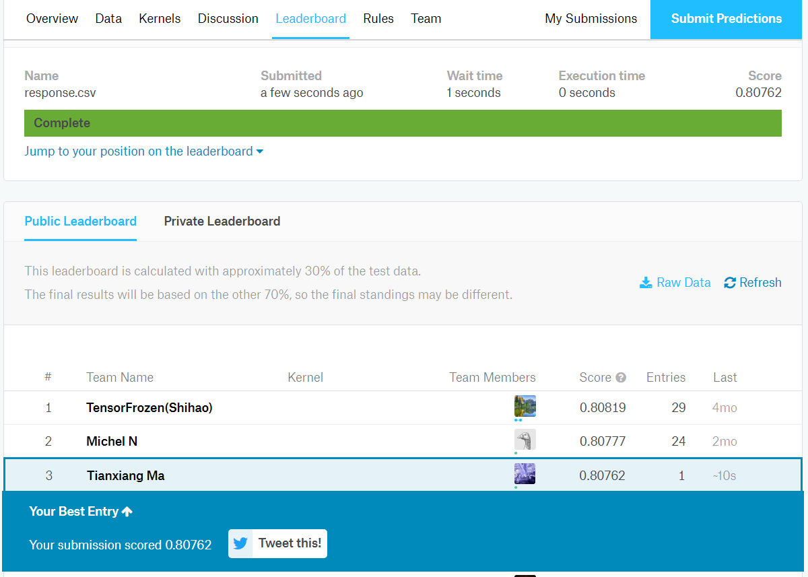

# Identify-Arvato-Customer-Segments

### Overview:
* Analyze demographics data (provided by Arvato Financial Solutions, a Bertelsmann subsidiary) for customers of a mail-order sales company in Germany, comparing it against demographics information for the general population. 

* Use unsupervised learning techniques to perform customer segmentation, identifying the parts of the population that best describe the core customer base of the company. 

* Use supervised learning techniques to predict customer responses in a marketing campaign for the mail-order company, which is also a [Kaggle competition](http://www.kaggle.com/t/21e6d45d4c574c7fa2d868f0e8c83140). 

### Installations:
Python 3 environment with following libraries:

* `numpy`
* `pandas`
* `sklearn`
* `xgboost`
* `matplotlib`
* `seaborn`

### File Description:
    .
    ├── dictionary     
    │   ├── AZDIAS_Feature_Summary.csv                        # Data dictionary from other projects
    │   ├── DIAS Attributes - Values 2017.xlsx	              # Data reference from Udacity Capstone project
    │   ├── DIAS Information Levels - Attributes 2017.xlsx    # Data reference from Udacity Capstone project
    │   └── feature_dict1.xlsx	                              # Synthetic Dictionary used for data preprocessing after engineering
    ├── model
    │   ├── km_10.m                                           # saved Kmeans model
    │   ├── pca_20.m                                          # saved PCA model
    │   ├── scaler_std.m                                      # saved Standard Scaler model
    │   └── xgb.m                                             # saved Xgboost model
    ├── README.md    
    ├── Arvato Project Workbook.ipynb                         # Jupyter Notebook for all process
    └── response.csv
    
### Results:
The submission file received a score of 0.80762 from Kaggle, which ranked top 3 on Public Leaderboard at the time and very close to the Top Score 0.808.

### Instructions:
The dataset used is not uploaded according to project terms and condition. To make the notebook run succesfully, you just need to download data files and put them in Home directory.
